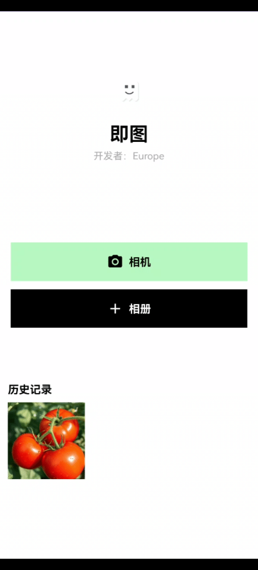
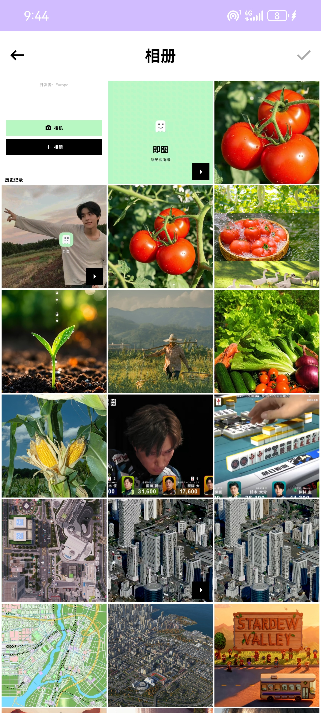
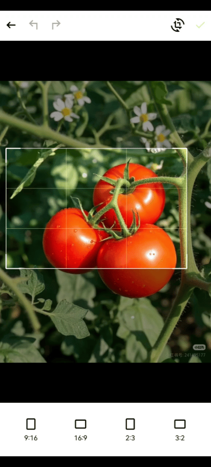
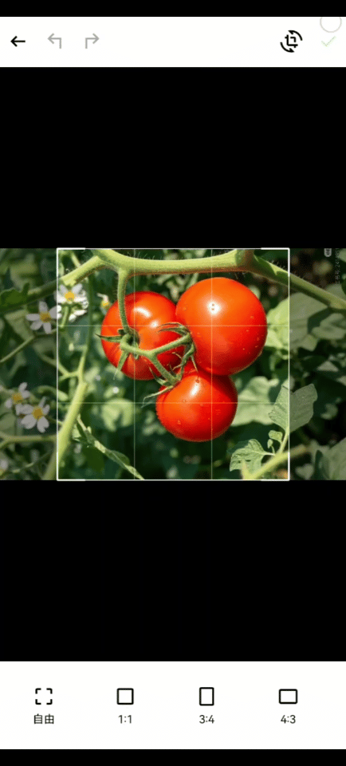
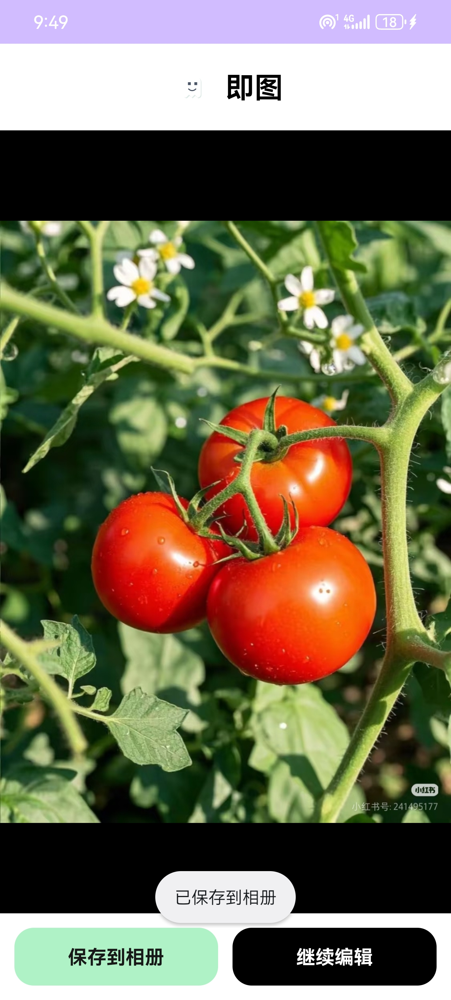
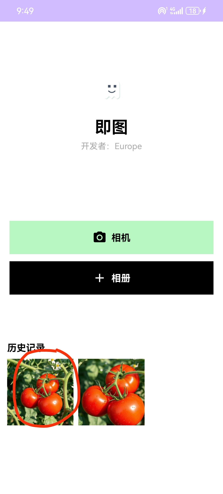

# 即图 — 简易修图 App

## 项目简介

**即图** 是一款基于 Android 的简易修图应用，采用 **Kotlin** 和 **OpenGL ES** 技术实现，提供了流畅且实用的图片编辑功能。核心功能包括 **裁剪、旋转、缩放**，并且支持 **Undo / Redo** 操作。通过自定义的动画效果和 OpenGL 渲染，用户可以享受到细腻的编辑体验。应用特别适合用来处理手机相册中的图片，并支持将编辑结果导出到相册。

项目目标是实现一个简易、流畅且用户友好的修图系统，同时提升用户体验和性能。

------

## 核心功能

### 1. **首页**

- **Logo 动效**：通过自定义 View 实现的炫酷扫光效果。

- **相册入口**：进入相册，快速浏览和选择图片。

- **相机入口**：调用系统相机拍照，进行编辑操作。

- **历史记录**：保存用户编辑过的图片，支持快速恢复。

  

### 2. **相册页**

- **快速加载**：通过 MediaStore 异步加载设备内的图片和视频，支持 20,000+ 张大图库。

  

- **多种格式支持**：支持加载 WebP、GIF、MP4 等媒体文件。

  

### 3. **编辑器**

- **裁剪功能**：支持多种裁剪比例（自由、1:1、3:4、4:3、9:16 等）。

  

- **旋转和缩放**：可旋转、缩放图片。

  

- **Undo / Redo**：撤销和恢复上一次的编辑操作。

  

- **自定义动画**：裁剪和旋转时添加平滑动画过渡。

  

### 4. **导出页**

- **保存到相册**：将编辑完成的图片保存到设备相册。

  

- **继续编辑**：返回主页，可通过历史记录继续修改当前图片。

  

------

## 构建与运行说明

### 环境要求

- **Android Studio**：版本 4.0 或更高
- **操作系统**：Windows / macOS / Linux
- **最低 SDK 版本**：Android 5.0（API 级别 21）
- **推荐 SDK 版本**：Android 10（API 级别 29）及以上

### 依赖库

- **Kotlin**：主语言
- **Jetpack**：包括 ViewModel、LiveData 和 Navigation 等
- **OpenGL ES 2.0**：用于图像处理和渲染
- **Glide**：图片加载库
- **MediaStore**：用于访问相册和视频文件
- **ProGuard / R8**：代码压缩和混淆